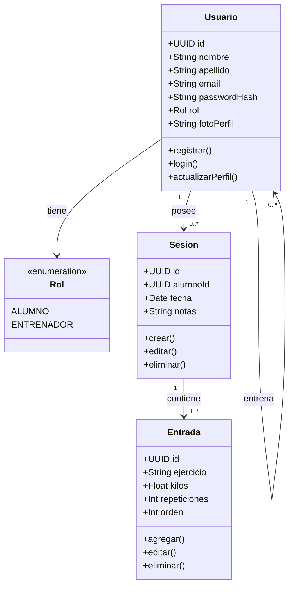
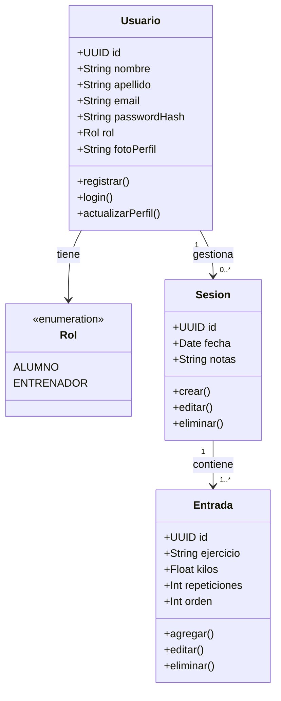

```mermaid
classDiagram
%% =======================
%% USUARIOS Y ROLES
%% =======================
class Usuario {
    +UUID id
    +String nombre
    +String apellido
    +String email
    +String passwordHash
    +Rol rol
    +String fotoPerfil
    +registrar()
    +login()
    +actualizarPerfil()
}
class Rol {
    <<enumeration>>
    ALUMNO
    ENTRENADOR
}

%% =======================
%% ENTRENAMIENTO
%% =======================
class Sesion {
    +UUID id
    +UUID alumnoId
    +Date fecha
    +String notas
    +crear()
    +editar()
    +eliminar()
}
class Entrada {
    +UUID id
    +String ejercicio
    +Float kilos
    +Int repeticiones
    +Int orden
    +agregar()
    +editar()
    +eliminar()
}

%% =======================
%% RELACIONES
%% =======================
Usuario --> Rol : tiene
Usuario "1" --> "0..*" Sesion : posee
Sesion "1" --> "1..*" Entrada : contiene
Usuario "1" --> "0..*" Usuario : entrena
```

```mermaid
classDiagram
%% =======================
%% USUARIOS Y ROLES
%% =======================
class Usuario {
    +UUID id
    +String nombre
    +String apellido
    +String email
    +String passwordHash
    +Rol rol
    +String fotoPerfil
    +registrar()
    +login()
    +actualizarPerfil()
}
class Rol {
    <<enumeration>>
    ALUMNO
    ENTRENADOR
}
%% =======================
%% ENTRENAMIENTO
%% =======================
class Sesion {
    +UUID id
    +Date fecha
    +String notas
    +crear()
    +editar()
    +eliminar()
}
class Entrada {
    +UUID id
    +String ejercicio
    +Float kilos
    +Int repeticiones
    +Int orden
    +agregar()
    +editar()
    +eliminar()
}
%% =======================
%% RELACIONES
%% =======================
Usuario --> Rol : tiene
Usuario "1" --> "0..*" Sesion : gestiona
Sesion "1" --> "1..*" Entrada : contiene
```

