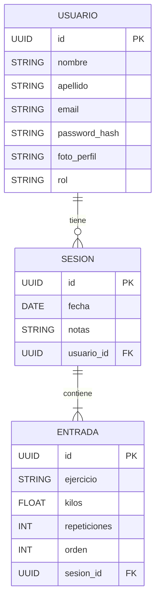

```mermaid
erDiagram

USUARIO {
    UUID id PK
    STRING nombre
    STRING apellido
    STRING email
    STRING password_hash
    STRING foto_perfil
    STRING rol
}

SESION {
    UUID id PK
    DATE fecha
    STRING notas
    UUID usuario_id FK
}

ENTRADA {
    UUID id PK
    STRING ejercicio
    FLOAT kilos
    INT repeticiones
    INT orden
    UUID sesion_id FK
}

%% =======================
%% RELACIONES
%% =======================

USUARIO ||--o{ SESION : tiene
SESION ||--|{ ENTRADA : contiene
```
