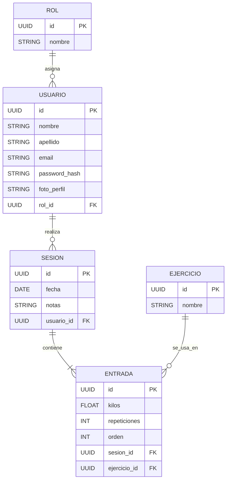

```mermaid
erDiagram

USUARIO {
    UUID id PK
    STRING nombre
    STRING apellido
    STRING email
    STRING password_hash
    STRING foto_perfil
    UUID rol_id FK
}

ROL {
    UUID id PK
    STRING nombre
}

SESION {
    UUID id PK
    DATE fecha
    STRING notas
    UUID usuario_id FK
}

EJERCICIO {
    UUID id PK
    STRING nombre
}

ENTRADA {
    UUID id PK
    FLOAT kilos
    INT repeticiones
    INT orden
    UUID sesion_id FK
    UUID ejercicio_id FK
}

%% =======================
%% RELACIONES
%% =======================

ROL ||--o{ USUARIO : asigna
USUARIO ||--o{ SESION : realiza
SESION ||--|{ ENTRADA : contiene
EJERCICIO ||--o{ ENTRADA : se_usa_en
```
